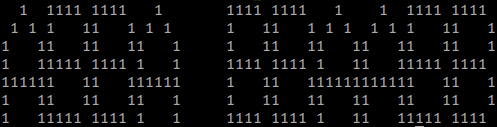

# GitHub-Contribution_Message:

## Script manual:

### txt2font.py:
- Execution:

		python3 ./txt2font.py [--font ] [--format | --no-format] [--debug] <text>

- Arguments:
	| Argument | use | requires str |
	|:--------:|:---:|:---:|
	| **--font \<font\>** | Change the font used to the file given | true |
	| **--format** | Format the output | false |
	| **--no-format** | Do not format the output | false |
	| **--debug** | Print debug information | false |

- Examples:
	- No arguments:

			python3 ./txt2font.py "abba bbaabb"

		